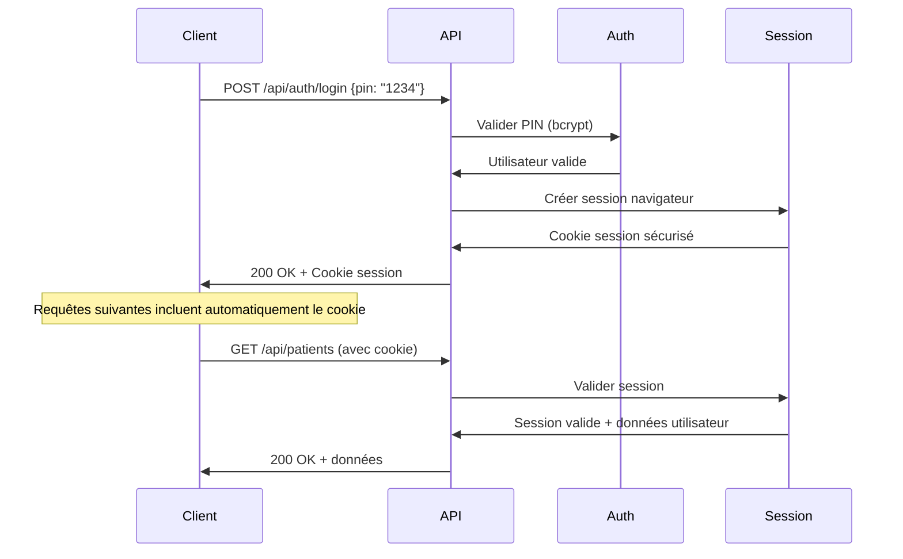

# Guide d'Intégration API - CLAIR

## Introduction

Ce guide détaille l'intégration avec les APIs CLAIR pour développeurs et partenaires techniques. Il couvre l'authentification, les endpoints disponibles, les formats de données et les meilleures pratiques d'intégration.

## Authentification et Accès

### Système d'Authentification

CLAIR utilise un système d'authentification basé sur **sessions PIN** plutôt que des tokens API traditionnels. Cette approche est optimisée pour les environnements de soins de santé où la simplicité et la sécurité sont primordiales.

**Flux d'authentification :**


### Établir une Session

**Endpoint de connexion :**
```http
POST /api/auth/login
Content-Type: application/json

{
  "pin": "1234"
}
```

**Réponse succès :**
```json
{
  "success": true,
  "user": {
    "_id": "user123",
    "firstName": "Jean",
    "lastName": "Dupont",
    "role": "standard",
    "isActive": true
  }
}
```

**Réponse erreur :**
```json
{
  "success": false,
  "error": "PIN invalide ou utilisateur inactif",
  "code": "INVALID_CREDENTIALS"
}
```

### Maintenir la Session

Les sessions sont maintenues via des cookies HTTP sécurisés :
- **HttpOnly** : Protection contre XSS
- **Secure** : HTTPS uniquement
- **SameSite=Strict** : Protection CSRF
- **Durée** : 8 heures d'inactivité

**Vérification de session :**
```http
GET /api/auth/session
```

**Réponse si connecté :**
```json
{
  "user": {
    "_id": "user123",
    "firstName": "Jean",
    "lastName": "Dupont",
    "role": "standard"
  }
}
```

**Déconnexion :**
```http
POST /api/auth/logout
```

---

## Endpoints Principaux

### Gestion des Usagers

#### Lister les Usagers
```http
GET /api/patients?includeInactive=false
Authorization: Session Cookie
```

**Réponse :**
```json
[
  {
    "_id": "patient123",
    "firstName": "Marie",
    "lastName": "Martin",
    "dateOfBirth": "1985-03-15T00:00:00.000Z",
    "profileImageURL": "/uploads/profiles/patient123.jpg",
    "allergies": ["Pénicilline", "Arachides"],
    "emergencyContacts": [
      {
        "name": "Paul Martin",
        "relationship": "Père",
        "phone": "514-555-0123"
      }
    ],
    "medicalNotes": "Diabète de type 2, sous surveillance",
    "isActive": true
  }
]
```

#### Créer un Usager
```http
POST /api/patients
Content-Type: application/json
Authorization: Session Cookie

{
  "firstName": "Claire",
  "lastName": "Dubois",
  "dateOfBirth": "1990-07-22",
  "allergies": ["Lactose"],
  "emergencyContacts": [
    {
      "name": "Michel Dubois",
      "relationship": "Époux",
      "phone": "438-555-0789"
    }
  ],
  "medicalNotes": "Intolérance au lactose confirmée"
}
```

#### Modifier un Usager
```http
PUT /api/patients/patient123
Content-Type: application/json

{
  "medicalNotes": "Diabète de type 2, nouvelle médication prescrite",
  "allergies": ["Pénicilline", "Arachides", "Sulfamides"]
}
```

### Rapports Quotidiens

#### Lister les Rapports
```http
GET /api/reports?startDate=2024-01-01&endDate=2024-01-31&shift=day&page=1&limit=10
```

**Paramètres de filtrage :**
- `startDate` : Date début (YYYY-MM-DD)
- `endDate` : Date fin (YYYY-MM-DD)  
- `shift` : Quart (day/evening/night)
- `page` : Numéro de page (défaut: 1)
- `limit` : Éléments par page (défaut: 10)

**Réponse :**
```json
{
  "reports": [
    {
      "_id": "report123",
      "shift": "day",
      "reportDate": "2024-01-15T00:00:00.000Z",
      "shiftSupervisor": "user123",
      "regularEmployees": ["user456", "user789"],
      "replacementEmployees": [
        {
          "name": "Temp Worker",
          "role": "Préposé",
          "notes": "Formation complétée"
        }
      ],
      "patientReports": [
        {
          "patientId": "patient123",
          "summary": "Journée calme, participation aux activités",
          "customFields": {
            "moodRating": 8,
            "medicationTaken": true
          },
          "authorId": "user123"
        }
      ],
      "shiftSummary": "Quart de jour sans incident particulier",
      "incidents": [],
      "createdAt": "2024-01-15T08:00:00.000Z",
      "updatedAt": "2024-01-15T08:00:00.000Z"
    }
  ],
  "pagination": {
    "page": 1,
    "limit": 10,
    "total": 45,
    "totalPages": 5,
    "hasNext": true,
    "hasPrev": false
  }
}
```

#### Créer un Rapport
```http
POST /api/reports
Content-Type: application/json

{
  "shift": "evening",
  "reportDate": "2024-01-20",
  "shiftSupervisor": "user123",
  "regularEmployees": ["user456"],
  "replacementEmployees": [],
  "patientReports": [
    {
      "patientId": "patient123",
      "summary": "Soirée agitée, difficulté à s'endormir",
      "customFields": {
        "moodRating": 4,
        "sleepDifficulty": true
      }
    }
  ],
  "shiftSummary": "Quart du soir avec quelques défis comportementaux",
  "incidents": ["Incident mineur chambre 12 - résolu"]
}
```

### Communications d'Équipe

#### Lister les Messages
```http
GET /api/communications?unreadOnly=false
```

**Réponse :**
```json
[
  {
    "_id": "comm123",
    "title": "Mise à jour protocole COVID",
    "content": "Nouveaux protocoles en vigueur dès lundi...",
    "priority": "high",
    "authorId": "user123",
    "readBy": [
      {
        "userId": "user456",
        "readAt": "2024-01-15T10:30:00.000Z"
      }
    ],
    "createdAt": "2024-01-15T09:00:00.000Z"
  }
]
```

#### Envoyer un Message
```http
POST /api/communications
Content-Type: application/json

{
  "title": "Maintenance système prévue",
  "content": "Maintenance planifiée dimanche de 2h à 4h du matin",
  "priority": "normal"
}
```

#### Marquer comme Lu
```http
PATCH /api/communications/comm123/read
```

### Échelle de Bristol

#### Consulter les Entrées
```http
GET /api/bristol?patientId=patient123&startDate=2024-01-01&endDate=2024-01-31
```

**Réponse :**
```json
[
  {
    "_id": "bristol123",
    "patientId": "patient123",
    "bristolType": 4,
    "entryDate": "2024-01-15T14:30:00.000Z",
    "notes": "Consistance normale",
    "recordedBy": "user123",
    "createdAt": "2024-01-15T14:35:00.000Z"
  }
]
```

#### Ajouter une Entrée
```http
POST /api/bristol
Content-Type: application/json

{
  "patientId": "patient123",
  "bristolType": 3,
  "entryDate": "2024-01-20T15:45:00.000Z",
  "notes": "Légèrement dur mais normal"
}
```

### Services IA

#### Correction de Texte
```http
POST /api/ai/correct-text
Content-Type: application/json

{
  "text": "Le patient a eut des dificulté a manger se matin"
}
```

**Réponse :**
```json
{
  "correctedText": "Le patient a eu des difficultés à manger ce matin",
  "suggestions": [
    "Correction: 'eut' → 'eu'",
    "Correction: 'dificulté' → 'difficultés'", 
    "Correction: 'a' → 'à'",
    "Correction: 'se' → 'ce'"
  ]
}
```

#### Génération de Résumé
```http
POST /api/ai/generate-summary
Content-Type: application/json

{
  "content": "Le patient Marie Martin a bien dormi cette nuit. Elle a pris son petit déjeuner vers 8h30 et a participé aux activités de groupe. Vers 14h, elle a eu un petit épisode d'agitation mais s'est calmée rapidement avec l'accompagnement de l'équipe. Elle a pris tous ses médicaments comme prescrit.",
  "maxLength": 100
}
```

**Réponse :**
```json
{
  "summary": "Marie a bien dormi et participé aux activités. Petit épisode d'agitation vers 14h, rapidement résolu. Médication prise correctement."
}
```

---

## Gestion des Erreurs

### Codes d'Erreur Standards

| Code HTTP | Signification | Action recommandée |
|-----------|---------------|-------------------|
| 400 | Requête malformée | Vérifier format JSON et champs requis |
| 401 | Non authentifié | Se connecter via /api/auth/login |
| 403 | Permissions insuffisantes | Vérifier rôle utilisateur |
| 404 | Ressource non trouvée | Vérifier ID de la ressource |
| 422 | Données invalides | Vérifier validation des champs |
| 429 | Trop de requêtes | Implémenter rate limiting côté client |
| 500 | Erreur serveur | Réessayer, contacter support si persistant |

### Format de Réponse d'Erreur

```json
{
  "success": false,
  "error": "Message d'erreur en français",
  "code": "ERROR_CODE",
  "details": {
    "field": "Détail spécifique de l'erreur",
    "validationErrors": ["Liste des erreurs de validation"]
  }
}
```

### Exemple de Gestion d'Erreurs

```javascript
async function createPatient(patientData) {
  try {
    const response = await fetch('/api/patients', {
      method: 'POST',
      headers: {
        'Content-Type': 'application/json',
      },
      body: JSON.stringify(patientData)
    });
    
    const result = await response.json();
    
    if (!response.ok) {
      // Gestion spécifique par code d'erreur
      switch (response.status) {
        case 401:
          // Rediriger vers login
          window.location.href = '/auth/login';
          break;
        case 403:
          throw new Error('Permissions insuffisantes pour cette action');
        case 422:
          throw new Error(`Données invalides: ${result.details.validationErrors.join(', ')}`);
        default:
          throw new Error(result.error || 'Erreur inconnue');
      }
    }
    
    return result;
  } catch (error) {
    console.error('Erreur création patient:', error);
    throw error;
  }
}
```

---

## Exemples d'Intégration

### Client JavaScript/TypeScript

```typescript
class CLAIRApiClient {
  private baseUrl: string;
  
  constructor(baseUrl: string = '/api') {
    this.baseUrl = baseUrl;
  }
  
  // Authentification
  async login(pin: string): Promise<User> {
    const response = await this.request('POST', '/auth/login', { pin });
    return response.user;
  }
  
  async logout(): Promise<void> {
    await this.request('POST', '/auth/logout');
  }
  
  // Patients
  async getPatients(includeInactive: boolean = false): Promise<Patient[]> {
    return this.request('GET', `/patients?includeInactive=${includeInactive}`);
  }
  
  async createPatient(patient: PatientInput): Promise<Patient> {
    return this.request('POST', '/patients', patient);
  }
  
  async updatePatient(id: string, updates: Partial<PatientInput>): Promise<Patient> {
    return this.request('PUT', `/patients/${id}`, updates);
  }
  
  // Rapports
  async getReports(filters: ReportFilters): Promise<ReportsResponse> {
    const params = new URLSearchParams(filters as any).toString();
    return this.request('GET', `/reports?${params}`);
  }
  
  async createReport(report: ReportInput): Promise<Report> {
    return this.request('POST', '/reports', report);
  }
  
  // Communications
  async getCommunications(unreadOnly: boolean = false): Promise<Communication[]> {
    return this.request('GET', `/communications?unreadOnly=${unreadOnly}`);
  }
  
  async sendMessage(message: MessageInput): Promise<Communication> {
    return this.request('POST', '/communications', message);
  }
  
  async markMessageRead(messageId: string): Promise<void> {
    await this.request('PATCH', `/communications/${messageId}/read`);
  }
  
  // IA
  async correctText(text: string): Promise<TextCorrection> {
    return this.request('POST', '/ai/correct-text', { text });
  }
  
  async generateSummary(content: string, maxLength: number = 200): Promise<Summary> {
    return this.request('POST', '/ai/generate-summary', { content, maxLength });
  }
  
  // Méthode utilitaire pour requêtes
  private async request(method: string, endpoint: string, data?: any): Promise<any> {
    const response = await fetch(`${this.baseUrl}${endpoint}`, {
      method,
      headers: {
        'Content-Type': 'application/json',
      },
      credentials: 'include', // Important pour les cookies de session
      body: data ? JSON.stringify(data) : undefined,
    });
    
    const result = await response.json();
    
    if (!response.ok) {
      throw new Error(result.error || `HTTP ${response.status}`);
    }
    
    return result;
  }
}

// Types TypeScript
interface User {
  _id: string;
  firstName: string;
  lastName: string;
  role: 'admin' | 'standard' | 'viewer';
  isActive: boolean;
}

interface Patient {
  _id: string;
  firstName: string;
  lastName: string;
  dateOfBirth: string;
  allergies: string[];
  emergencyContacts: EmergencyContact[];
  medicalNotes?: string;
  isActive: boolean;
}

interface PatientInput {
  firstName: string;
  lastName: string;
  dateOfBirth: string;
  allergies?: string[];
  emergencyContacts?: EmergencyContact[];
  medicalNotes?: string;
}
```

### Intégration React

```typescript
import React, { useState, useEffect } from 'react';
import { CLAIRApiClient } from './clair-api-client';

const PatientList: React.FC = () => {
  const [patients, setPatients] = useState<Patient[]>([]);
  const [loading, setLoading] = useState(true);
  const [error, setError] = useState<string | null>(null);
  
  const apiClient = new CLAIRApiClient();
  
  useEffect(() => {
    loadPatients();
  }, []);
  
  const loadPatients = async () => {
    try {
      setLoading(true);
      const patientsData = await apiClient.getPatients();
      setPatients(patientsData);
      setError(null);
    } catch (err) {
      setError(err instanceof Error ? err.message : 'Erreur de chargement');
    } finally {
      setLoading(false);
    }
  };
  
  const handleAddPatient = async (patientData: PatientInput) => {
    try {
      const newPatient = await apiClient.createPatient(patientData);
      setPatients(prev => [...prev, newPatient]);
    } catch (err) {
      setError(err instanceof Error ? err.message : 'Erreur de création');
    }
  };
  
  if (loading) return <div>Chargement...</div>;
  if (error) return <div>Erreur: {error}</div>;
  
  return (
    <div>
      <h2>Liste des Usagers</h2>
      {patients.map(patient => (
        <div key={patient._id}>
          <h3>{patient.firstName} {patient.lastName}</h3>
          <p>Allergies: {patient.allergies.join(', ')}</p>
        </div>
      ))}
    </div>
  );
};
```

### Intégration Python

```python
import requests
from datetime import datetime
from typing import Dict, List, Optional

class CLAIRApiClient:
    def __init__(self, base_url: str = "https://dev.meziani.org/api"):
        self.base_url = base_url
        self.session = requests.Session()
    
    def login(self, pin: str) -> Dict:
        """Authentification avec PIN"""
        response = self.session.post(
            f"{self.base_url}/auth/login",
            json={"pin": pin}
        )
        response.raise_for_status()
        return response.json()
    
    def get_patients(self, include_inactive: bool = False) -> List[Dict]:
        """Récupérer liste des patients"""
        params = {"includeInactive": include_inactive}
        response = self.session.get(
            f"{self.base_url}/patients",
            params=params
        )
        response.raise_for_status()
        return response.json()
    
    def create_patient(self, patient_data: Dict) -> Dict:
        """Créer un nouveau patient"""
        response = self.session.post(
            f"{self.base_url}/patients",
            json=patient_data
        )
        response.raise_for_status()
        return response.json()
    
    def get_reports(self, 
                   start_date: Optional[str] = None,
                   end_date: Optional[str] = None,
                   shift: Optional[str] = None) -> Dict:
        """Récupérer rapports avec filtres"""
        params = {}
        if start_date:
            params["startDate"] = start_date
        if end_date:
            params["endDate"] = end_date
        if shift:
            params["shift"] = shift
            
        response = self.session.get(
            f"{self.base_url}/reports",
            params=params
        )
        response.raise_for_status()
        return response.json()
    
    def correct_text(self, text: str) -> Dict:
        """Correction IA du texte"""
        response = self.session.post(
            f"{self.base_url}/ai/correct-text",
            json={"text": text}
        )
        response.raise_for_status()
        return response.json()

# Exemple d'utilisation
def main():
    client = CLAIRApiClient()
    
    # Connexion
    user = client.login("1234")
    print(f"Connecté en tant que: {user['user']['firstName']}")
    
    # Récupérer patients
    patients = client.get_patients()
    print(f"Nombre de patients: {len(patients)}")
    
    # Correction de texte
    correction = client.correct_text("Le patient a eut des problemen")
    print(f"Texte corrigé: {correction['correctedText']}")

if __name__ == "__main__":
    main()
```

---

## Bonnes Pratiques

### Performance et Optimisation

#### Cache et Pagination
```javascript
// Implémenter cache côté client pour données statiques
const cache = new Map();

async function getCachedPatients() {
  const cacheKey = 'patients_active';
  const cached = cache.get(cacheKey);
  
  if (cached && Date.now() - cached.timestamp < 300000) { // 5 minutes
    return cached.data;
  }
  
  const patients = await apiClient.getPatients();
  cache.set(cacheKey, {
    data: patients,
    timestamp: Date.now()
  });
  
  return patients;
}

// Pagination pour grandes listes
async function getReportsPaginated(page = 1, limit = 20) {
  return apiClient.getReports({
    page,
    limit,
    // Autres filtres...
  });
}
```

#### Rate Limiting
```javascript
// Implémentation simple de rate limiting
class RateLimiter {
  private requests: number[] = [];
  private maxRequests: number;
  private timeWindow: number;
  
  constructor(maxRequests = 100, timeWindowMs = 60000) {
    this.maxRequests = maxRequests;
    this.timeWindow = timeWindowMs;
  }
  
  async checkLimit(): Promise<void> {
    const now = Date.now();
    this.requests = this.requests.filter(time => now - time < this.timeWindow);
    
    if (this.requests.length >= this.maxRequests) {
      const waitTime = this.timeWindow - (now - this.requests[0]);
      await new Promise(resolve => setTimeout(resolve, waitTime));
      return this.checkLimit();
    }
    
    this.requests.push(now);
  }
}
```

### Sécurité

#### Validation Côté Client
```typescript
// Validation des données avant envoi
function validatePatientData(data: PatientInput): string[] {
  const errors: string[] = [];
  
  if (!data.firstName?.trim()) {
    errors.push('Le prénom est requis');
  }
  
  if (!data.lastName?.trim()) {
    errors.push('Le nom est requis');
  }
  
  if (!data.dateOfBirth) {
    errors.push('La date de naissance est requise');
  } else {
    const birthDate = new Date(data.dateOfBirth);
    if (birthDate > new Date()) {
      errors.push('La date de naissance ne peut pas être dans le futur');
    }
  }
  
  // Validation contacts d'urgence
  data.emergencyContacts?.forEach((contact, index) => {
    if (!contact.name?.trim()) {
      errors.push(`Contact ${index + 1}: Le nom est requis`);
    }
    if (!contact.phone?.trim()) {
      errors.push(`Contact ${index + 1}: Le téléphone est requis`);
    }
  });
  
  return errors;
}
```

#### Protection Données Sensibles
```typescript
// Masquer données sensibles dans logs
function sanitizeForLogging(data: any): any {
  const sanitized = { ...data };
  
  // Masquer informations sensibles
  if (sanitized.pin) sanitized.pin = '****';
  if (sanitized.phone) sanitized.phone = sanitized.phone.replace(/\d{4}$/, 'XXXX');
  if (sanitized.medicalNotes) sanitized.medicalNotes = '[MASKED]';
  
  return sanitized;
}

// Utilisation
console.log('Requête patient:', sanitizeForLogging(patientData));
```

### Gestion d'État

#### Pattern State Management
```typescript
// État global pour application React
interface AppState {
  user: User | null;
  patients: Patient[];
  communications: Communication[];
  loading: boolean;
  error: string | null;
}

// Actions pour mutations d'état
type AppAction = 
  | { type: 'SET_USER'; payload: User }
  | { type: 'SET_PATIENTS'; payload: Patient[] }
  | { type: 'ADD_PATIENT'; payload: Patient }
  | { type: 'UPDATE_PATIENT'; payload: { id: string; updates: Partial<Patient> } }
  | { type: 'SET_LOADING'; payload: boolean }
  | { type: 'SET_ERROR'; payload: string | null };

// Reducer pour gestion d'état
function appReducer(state: AppState, action: AppAction): AppState {
  switch (action.type) {
    case 'SET_USER':
      return { ...state, user: action.payload };
    case 'SET_PATIENTS':
      return { ...state, patients: action.payload };
    case 'ADD_PATIENT':
      return { ...state, patients: [...state.patients, action.payload] };
    case 'UPDATE_PATIENT':
      return {
        ...state,
        patients: state.patients.map(p => 
          p._id === action.payload.id 
            ? { ...p, ...action.payload.updates }
            : p
        )
      };
    case 'SET_LOADING':
      return { ...state, loading: action.payload };
    case 'SET_ERROR':
      return { ...state, error: action.payload };
    default:
      return state;
  }
}
```

---

## Support et Ressources

### Documentation Complémentaire

- **Spécification OpenAPI/Swagger** : `/docs/api/swagger.yaml`
- **Exemples de code** : Repository GitHub `/examples`
- **Guide utilisateur** : `/docs/user-guide/guide-utilisateur.md`
- **Architecture technique** : `/docs/technical/architecture.md`

### Environnements de Test

| Environnement | URL | Usage |
|---------------|-----|-------|
| **Production** | https://dev.meziani.org | Données réelles, ne pas utiliser pour tests |
| **Développement** | http://localhost:3000 | Environnement local avec données de test |

### Support Technique

**Contact pour intégrations :**
- **Email** : dev@meziani.org
- **Documentation** : https://dev.meziani.org/docs
- **Issues GitHub** : https://github.com/yanimeziani/CLAIR/issues

**SLA de Support :**
- **Issues critiques** : 4h ouvrables
- **Issues standard** : 2 jours ouvrables  
- **Demandes d'amélioration** : 1 semaine ouvrables

---

**Version du Guide** : 1.0.0  
**Dernière mise à jour** : Janvier 2025  
**Compatible avec** : CLAIR API v1.0.0