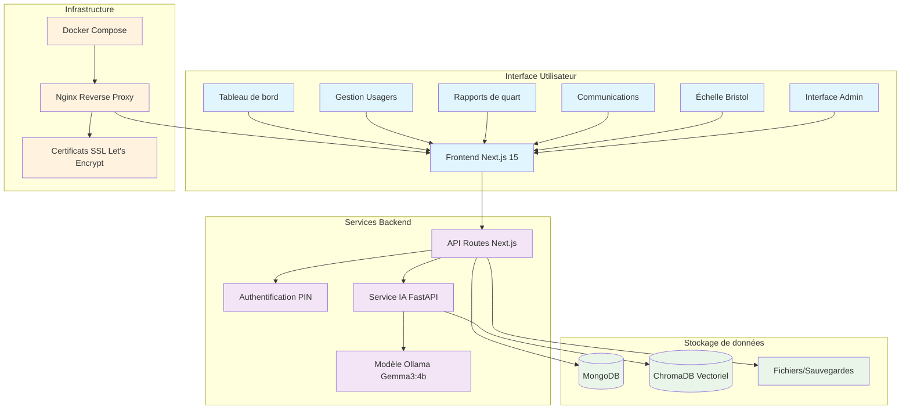
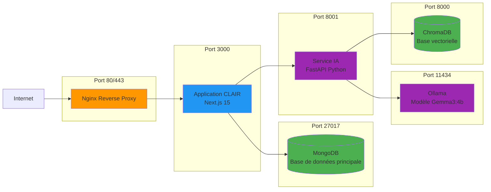
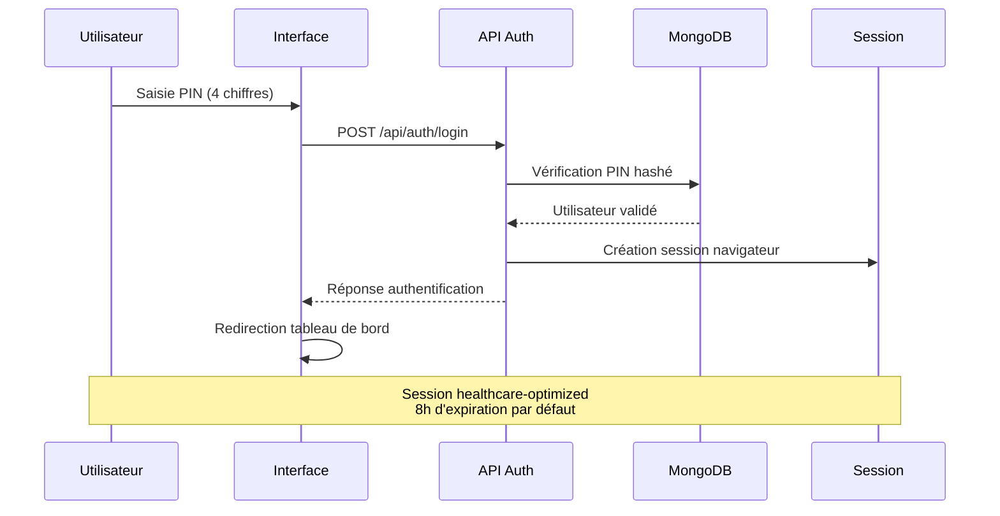
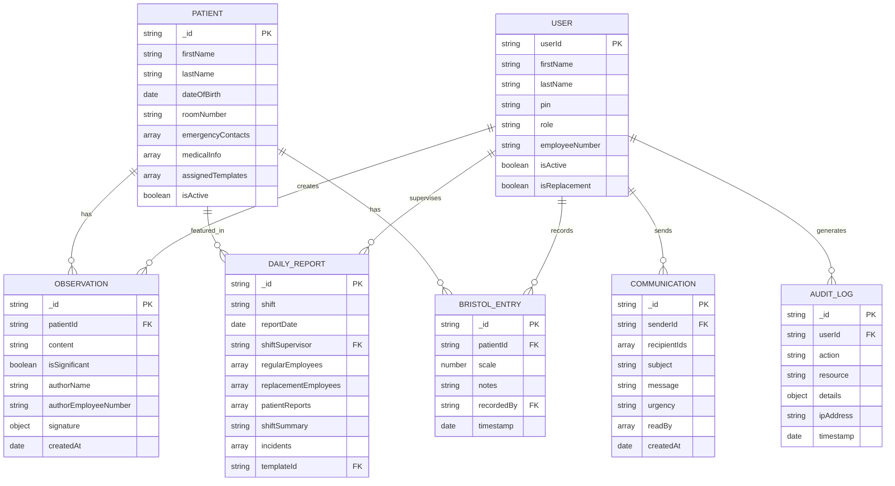
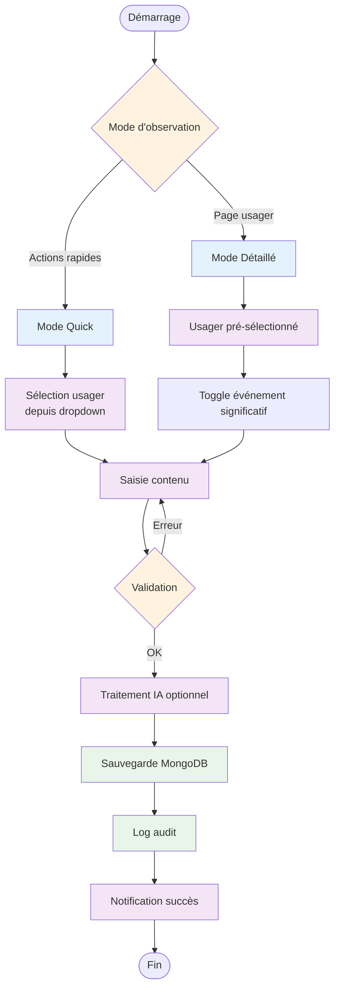
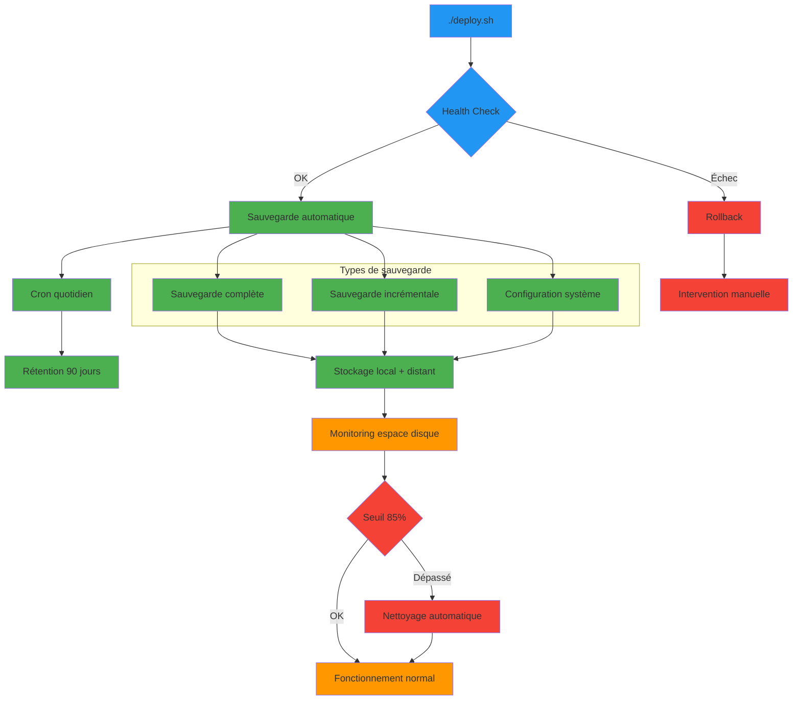
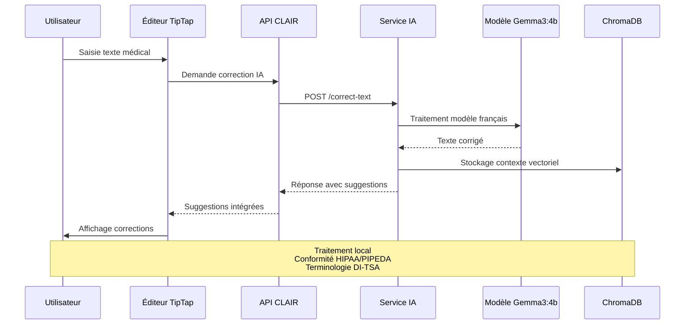
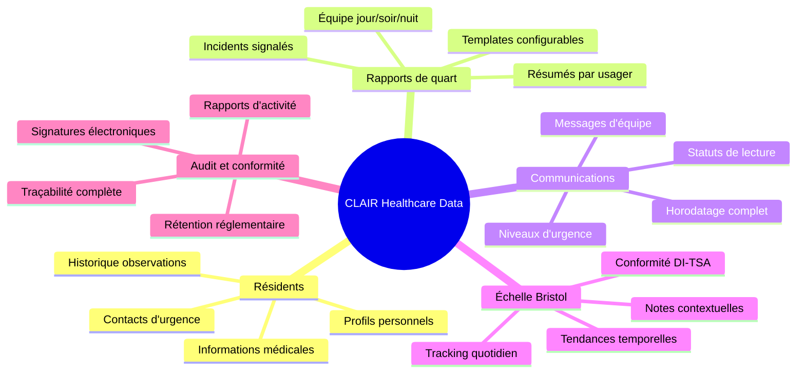

# CLAIR - Diagrammes d'Architecture

## Vue d'ensemble du système

## Architecture des microservices

## Flux d'authentification PIN

## Modèle de données principal

## Flux de création d'observation

## Architecture des rôles et permissions

```mermaid
graph TD
    subgraph "Hiérarchie des rôles"
        Admin[Admin]
        Standard[Standard]
        Viewer[Viewer]
    end

    subgraph "Permissions Admin"
        UserMgmt[Gestion utilisateurs]
        Templates[Templates de rapports]
        SystemOps[Opérations système]
        DataExport[Exports de données]
        AuditView[Visualisation audit]
        Settings[Paramètres système]
    end

    subgraph "Permissions Standard"
        CreateReports[Création rapports]
        EditPatients[Modification usagers]
        Observations[Observations]
        Communications[Communications]
        Bristol[Échelle Bristol]
    end

    subgraph "Permissions Viewer"
        ViewReports[Lecture rapports]
        ViewPatients[Lecture usagers]
        ViewComms[Lecture communications]
    end

    Admin --> UserMgmt
    Admin --> Templates
    Admin --> SystemOps
    Admin --> DataExport
    Admin --> AuditView
    Admin --> Settings
    Admin --> CreateReports
    Admin --> EditPatients
    Admin --> Observations
    Admin --> Communications
    Admin --> Bristol
    Admin --> ViewReports
    Admin --> ViewPatients
    Admin --> ViewComms

    Standard --> CreateReports
    Standard --> EditPatients
    Standard --> Observations
    Standard --> Communications
    Standard --> Bristol
    Standard --> ViewReports
    Standard --> ViewPatients
    Standard --> ViewComms

    Viewer --> ViewReports
    Viewer --> ViewPatients
    Viewer --> ViewComms

    classDef admin fill:#f44336
    classDef standard fill:#ff9800
    classDef viewer fill:#4caf50
    classDef permission fill:#e1f5fe

    class Admin admin
    class Standard standard
    class Viewer viewer
    class UserMgmt,Templates,SystemOps,DataExport,AuditView,Settings,CreateReports,EditPatients,Observations,Communications,Bristol,ViewReports,ViewPatients,ViewComms permission
```

## Flux de déploiement et sauvegarde

## Intégration IA et traitement de texte

## Vue d'ensemble des données de santé

Ces diagrammes capturent l'essence du projet CLAIR en montrant :

1. **Architecture système** - Infrastructure microservices avec Docker
2. **Modèle de données** - Relations entre entités healthcare
3. **Flux utilisateur** - Processus d'authentification et d'observation  
4. **Permissions** - Hiérarchie des rôles Admin/Standard/Viewer
5. **Déploiement** - Pipeline automatisé avec sauvegardes
6. **IA locale** - Traitement privé pour conformité HIPAA
7. **Vue holistique** - Écosystème complet de données de santé

Parfait pour présenter le projet aux parties prenantes techniques et métier.