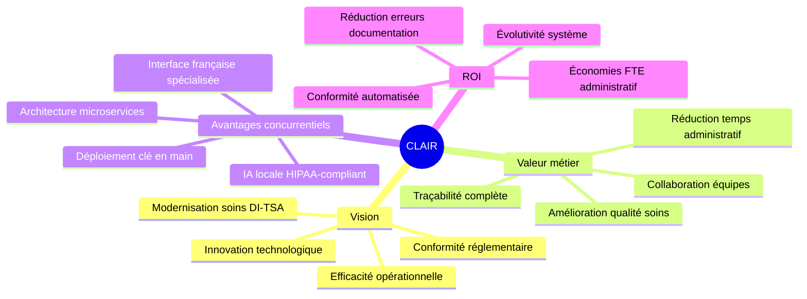
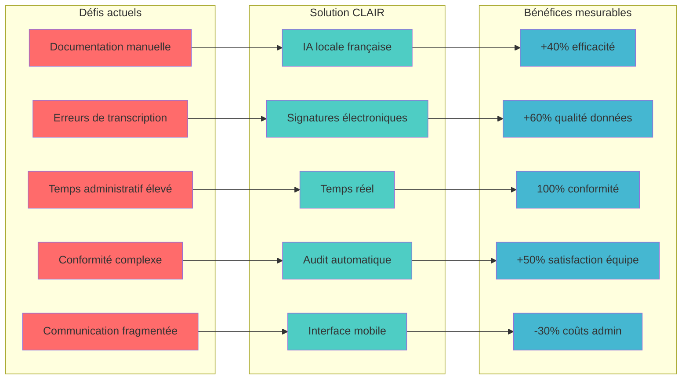
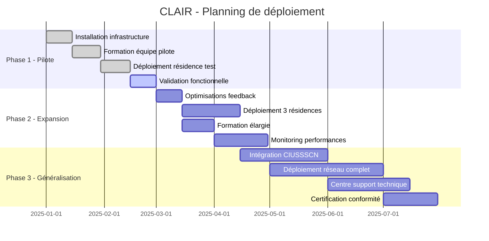
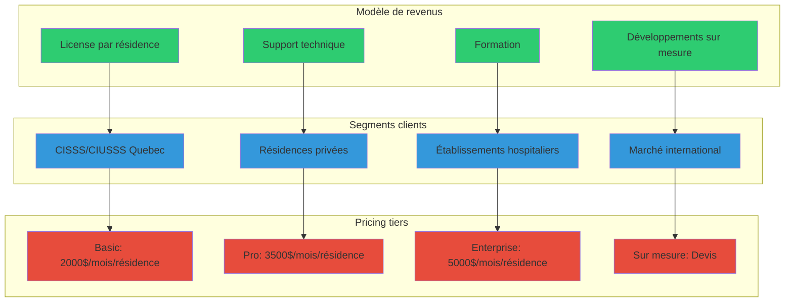
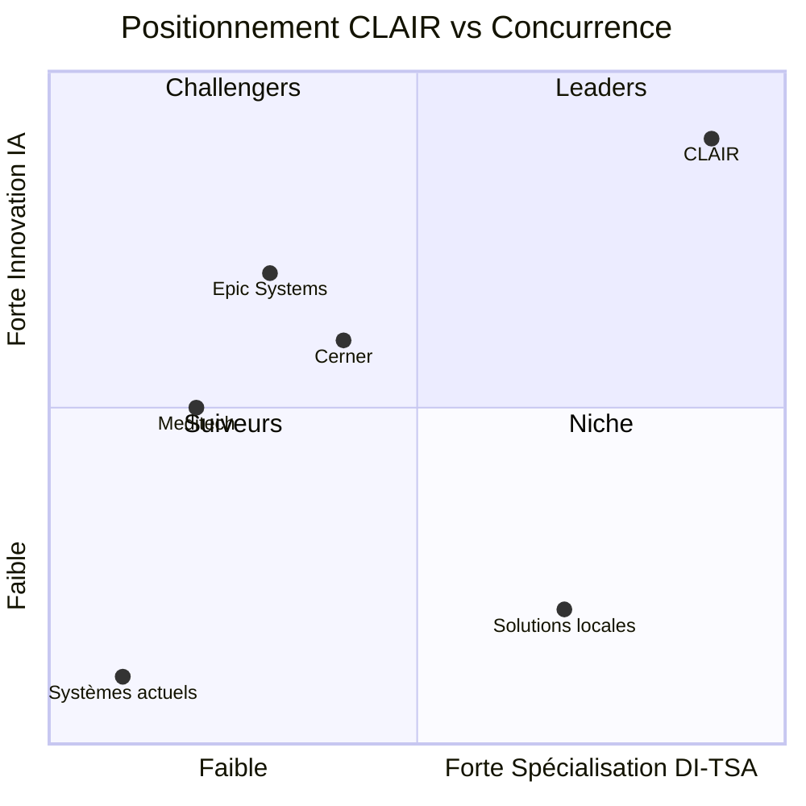
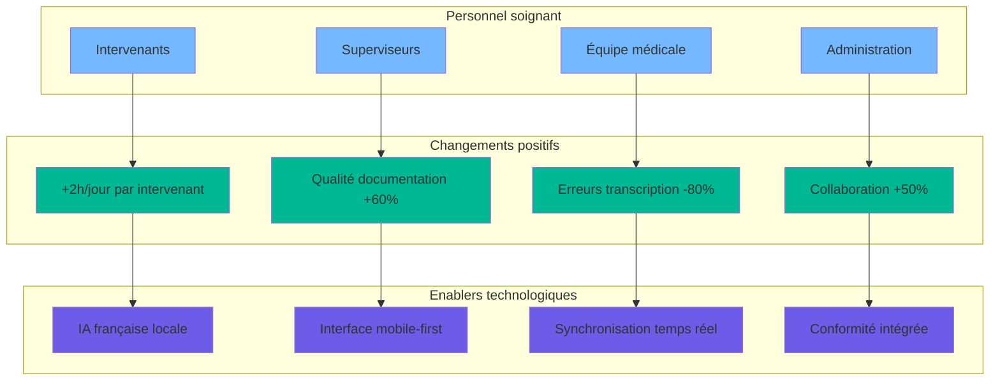
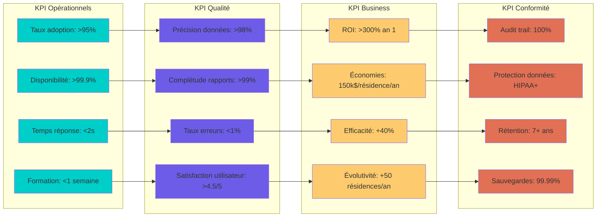
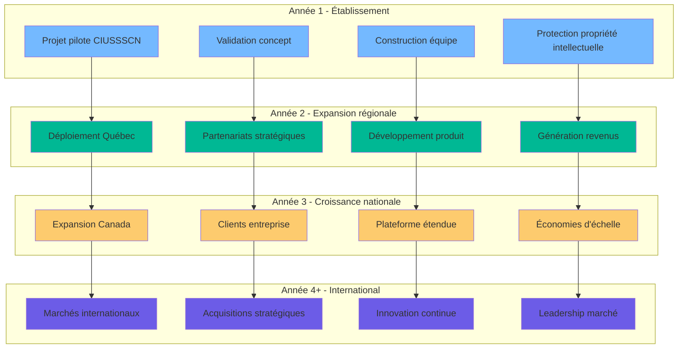
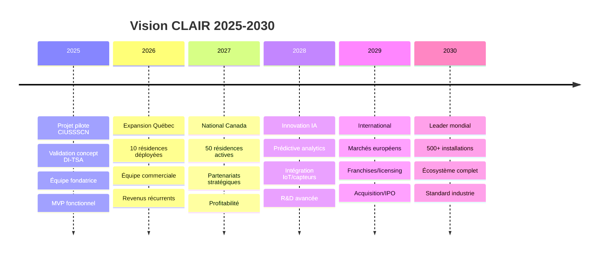

# CLAIR - Diagrammes de présentation exécutive

## Vue d'ensemble stratégique

## Proposition de valeur CLAIR

## Roadmap de déploiement

## Modèle économique et licensing

## Analyse concurrentielle

## Impact organisationnel

## Métriques de succès KPI

## Stratégie de croissance

## Vision long terme

Ces diagrammes de présentation capturent l'essence stratégique de CLAIR pour les parties prenantes exécutives :

1. **Mindmap stratégique** - Vision globale et valeur
2. **Proposition de valeur** - Problèmes → Solutions → Bénéfices
3. **Roadmap** - Planning de déploiement structuré
4. **Modèle économique** - Revenus et segments clients
5. **Positionnement** - Avantage concurrentiel visualisé
6. **Impact organisationnel** - Transformation des équipes
7. **KPI de succès** - Métriques mesurables
8. **Croissance** - Stratégie d'expansion 4 ans
9. **Vision long terme** - Timeline 2025-2030

Parfait pour présenter aux investisseurs, décideurs CIUSSSCN et partenaires stratégiques.