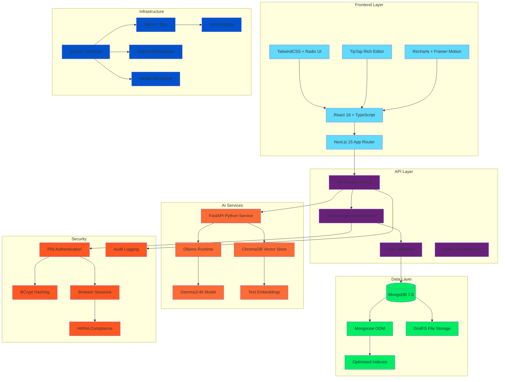
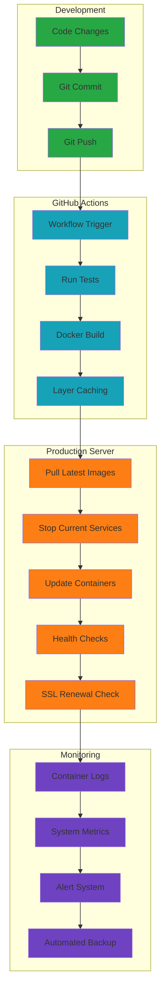
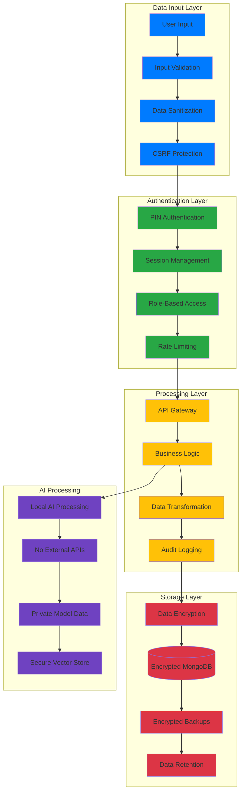
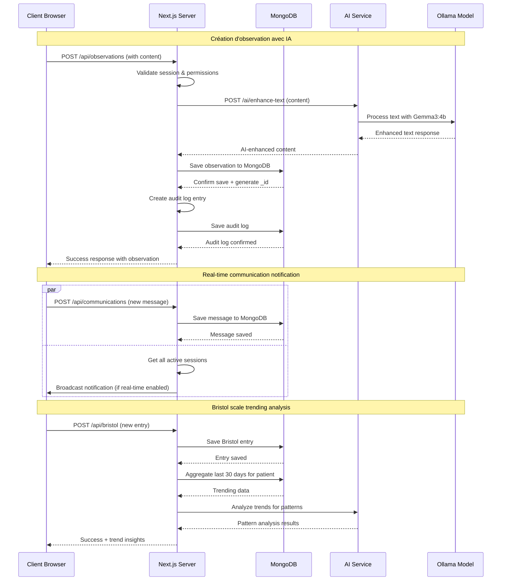
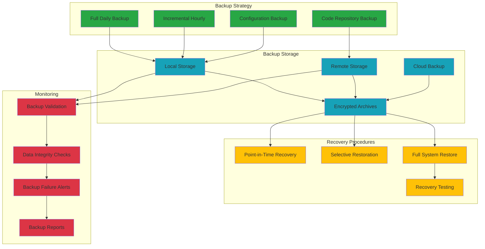

# CLAIR - Diagrammes techniques avancés

## Stack technologique complet

## Pipeline de déploiement CI/CD

## Architecture de sécurité des données

## Performance et optimisation

```mermaid
graph LR
    subgraph "Frontend Optimization"
        SSG[Static Site Generation]
        ISR[Incremental Static Regeneration]
        CodeSplit[Code Splitting]
        LazyLoad[Lazy Loading]
        ImageOpt[Image Optimization]
    end

    subgraph "API Optimization"
        Caching[Response Caching]
        Pagination[Smart Pagination]
        Indexes[Database Indexes]
        Connection[Connection Pooling]
        Compression[Response Compression]
    end

    subgraph "Database Optimization"
        Aggregation[MongoDB Aggregation]
        Sharding[Collection Sharding]
        Replication[Read Replicas]
        Indexing[Compound Indexes]
        TTL[TTL Indexes]
    end

    subgraph "Infrastructure Optimization"
        CDN[CDN Distribution]
        LoadBalance[Load Balancing]
        HTTP2[HTTP/2 Support]
        Gzip[Gzip Compression]
        Minification[Asset Minification]
    end

    SSG --> ISR
    ISR --> CodeSplit
    CodeSplit --> LazyLoad
    LazyLoad --> ImageOpt

    Caching --> Pagination
    Pagination --> Indexes
    Indexes --> Connection
    Connection --> Compression

    Aggregation --> Sharding
    Sharding --> Replication
    Replication --> Indexing
    Indexing --> TTL

    CDN --> LoadBalance
    LoadBalance --> HTTP2
    HTTP2 --> Gzip
    Gzip --> Minification

    classDef frontend fill:#61dafb
    classDef api fill:#28a745
    classDef database fill:#ff6b35
    classDef infra fill:#6f42c1

    class SSG,ISR,CodeSplit,LazyLoad,ImageOpt frontend
    class Caching,Pagination,Indexes,Connection,Compression api
    class Aggregation,Sharding,Replication,Indexing,TTL database
    class CDN,LoadBalance,HTTP2,Gzip,Minification infra
```

## Système de monitoring et observabilité

```mermaid
flowchart TD
    subgraph "Application Metrics"
        AppLogs[Application Logs]
        ErrorTracking[Error Tracking]
        Performance[Performance Metrics]
        UserActions[User Action Analytics]
    end

    subgraph "Infrastructure Metrics"
        ContainerStats[Container Statistics]
        ResourceUsage[Resource Usage]
        NetworkMetrics[Network Metrics]
        DiskSpace[Disk Space Monitoring]
    end

    subgraph "Database Metrics"
        QueryPerf[Query Performance]
        ConnectionPool[Connection Pool Stats]
        IndexUsage[Index Usage Statistics]
        ReplicationLag[Replication Lag]
    end

    subgraph "AI Service Metrics"
        ModelLatency[Model Response Time]
        ProcessingQueue[Processing Queue Length]
        ErrorRates[AI Error Rates]
        ResourceConsumption[GPU/CPU Usage]
    end

    subgraph "Alert System"
        Thresholds[Alert Thresholds]
        NotificationChannels[Notification Channels]
        Escalation[Escalation Policies]
        Dashboard[Monitoring Dashboard]
    end

    AppLogs --> Thresholds
    ErrorTracking --> Thresholds
    Performance --> Thresholds
    UserActions --> Dashboard

    ContainerStats --> Thresholds
    ResourceUsage --> Thresholds
    NetworkMetrics --> Dashboard
    DiskSpace --> Thresholds

    QueryPerf --> Thresholds
    ConnectionPool --> Dashboard
    IndexUsage --> Dashboard
    ReplicationLag --> Thresholds

    ModelLatency --> Thresholds
    ProcessingQueue --> Thresholds
    ErrorRates --> Thresholds
    ResourceConsumption --> Dashboard

    Thresholds --> NotificationChannels
    NotificationChannels --> Escalation
    Escalation --> Dashboard

    classDef app fill:#28a745
    classDef infra fill:#17a2b8
    classDef db fill:#ff6b35
    classDef ai fill:#6f42c1
    classDef alert fill:#dc3545

    class AppLogs,ErrorTracking,Performance,UserActions app
    class ContainerStats,ResourceUsage,NetworkMetrics,DiskSpace infra
    class QueryPerf,ConnectionPool,IndexUsage,ReplicationLag db
    class ModelLatency,ProcessingQueue,ErrorRates,ResourceConsumption ai
    class Thresholds,NotificationChannels,Escalation,Dashboard alert
```

## Flux de données en temps réel

## Architecture de sauvegarde et récupération

Ces diagrammes techniques avancés couvrent :

1. **Stack technologique** - Écosystème complet des technologies
2. **Pipeline CI/CD** - Déploiement automatisé avec GitHub Actions
3. **Sécurité** - Architecture de protection des données healthcare
4. **Performance** - Optimisations multi-niveaux
5. **Monitoring** - Observabilité et alerting système
6. **Temps réel** - Flux de données synchrones/asynchrones
7. **Backup/Recovery** - Stratégie de sauvegarde entreprise

Parfait pour présenter la robustesse technique aux équipes IT et décideurs.