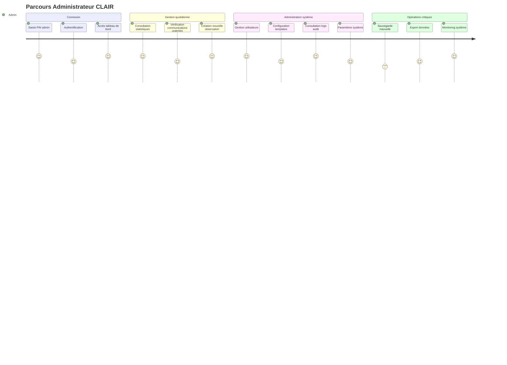
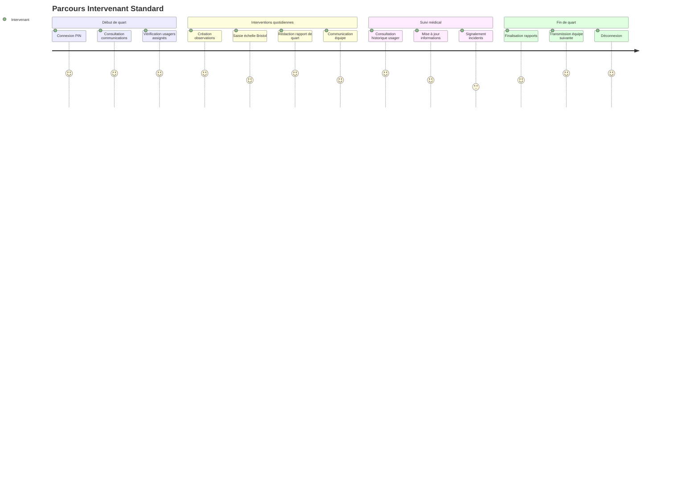
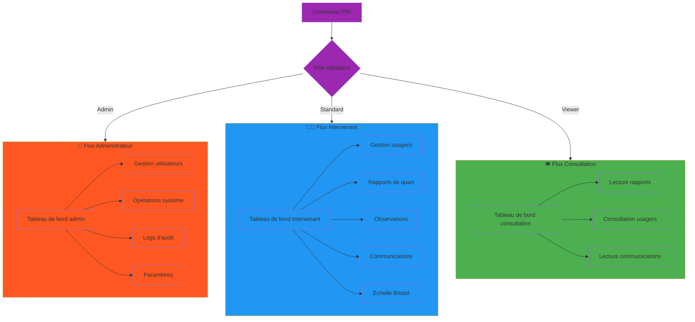
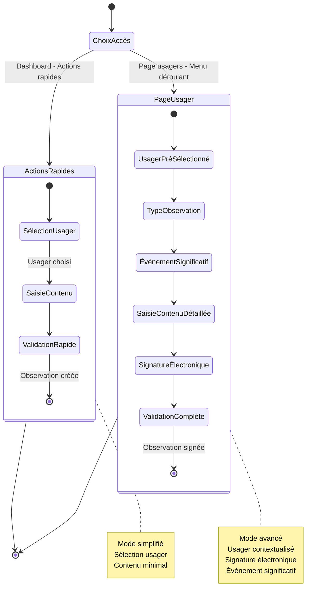
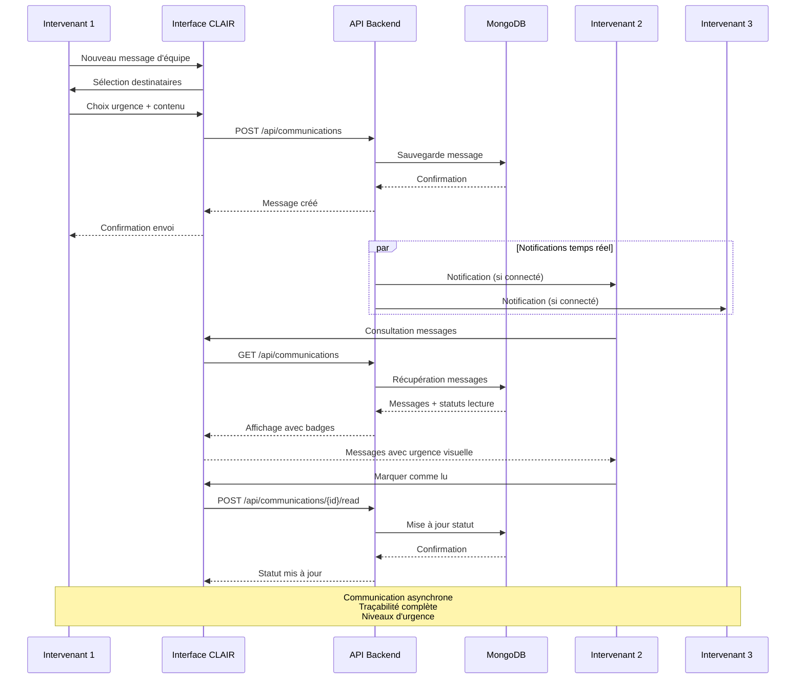
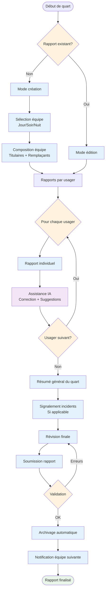
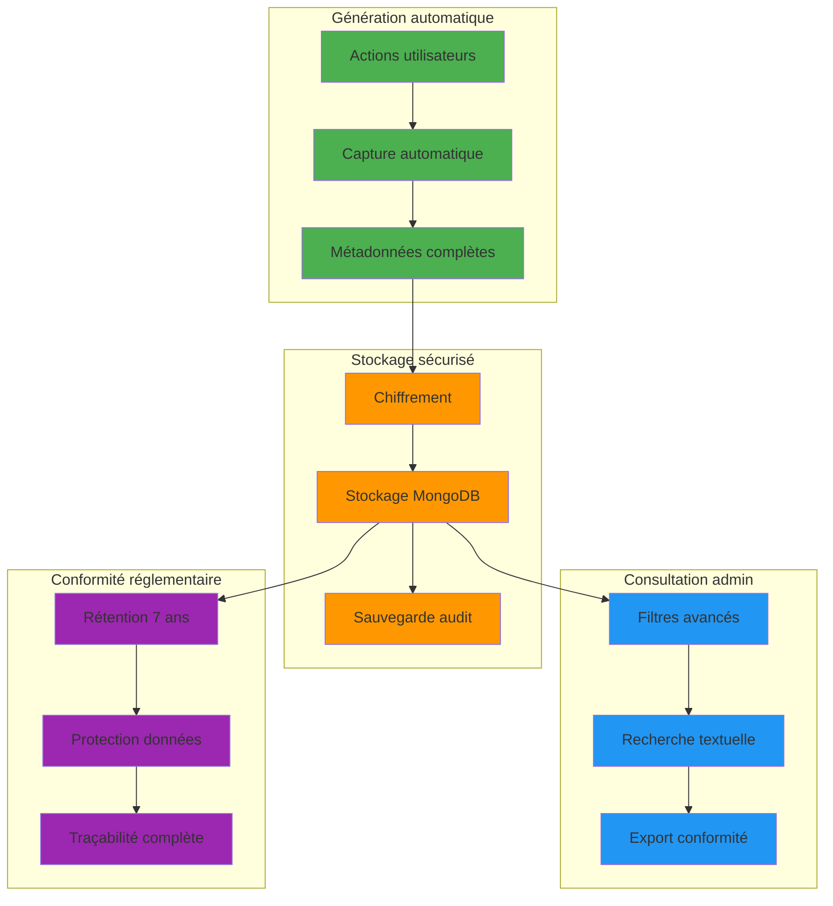

# CLAIR - Diagrammes de parcours utilisateur

## Parcours utilisateur par rôle

## Flux d'interaction par fonctionnalité

## Parcours de création d'observation détaillé

## Flux de communication d'équipe

## Parcours de rapport de quart

## Écosystème Bristol Scale - Parcours spécialisé DI-TSA

```mermaid
flowchart LR
    subgraph "Saisie quotidienne"
        Entry[Nouvelle entrée Bristol]
        Scale[Sélection échelle 1-7]
        Notes[Notes contextuelles]
        Time[Horodatage précis]
    end
    
    subgraph "Validation"
        Check[Vérification cohérence]
        Confirm[Confirmation saisie]
    end
    
    subgraph "Analyse"
        Trends[Analyse tendances]
        Patterns[Détection patterns]
        Alerts[Alertes déviations]
    end
    
    subgraph "Reporting"
        Daily[Rapport quotidien]
        Weekly[Rapport hebdomadaire]
        Medical[Rapport médical]
    end
    
    Entry --> Scale
    Scale --> Notes
    Notes --> Time
    Time --> Check
    Check --> Confirm
    Confirm --> Trends
    Trends --> Patterns
    Patterns --> Alerts
    Alerts --> Daily
    Daily --> Weekly
    Weekly --> Medical

    classDef input fill:#e3f2fd
    classDef validation fill:#fff3e0
    classDef analysis fill:#f3e5f5
    classDef output fill:#e8f5e8

    class Entry,Scale,Notes,Time input
    class Check,Confirm validation
    class Trends,Patterns,Alerts analysis
    class Daily,Weekly,Medical output
```

## Parcours d'audit et conformité

Ces diagrammes illustrent les parcours utilisateur essentiels de CLAIR :

1. **Journeys par rôle** - Expérience quotidienne Admin/Standard/Viewer
2. **Flux d'interaction** - Navigation entre fonctionnalités
3. **Création d'observation** - Processus détaillé dual
4. **Communication équipe** - Flux temps réel asynchrone
5. **Rapport de quart** - Workflow complet avec IA
6. **Bristol Scale** - Parcours spécialisé DI-TSA
7. **Audit** - Conformité et traçabilité

Parfait pour démontrer l'UX et les processus métier aux parties prenantes.